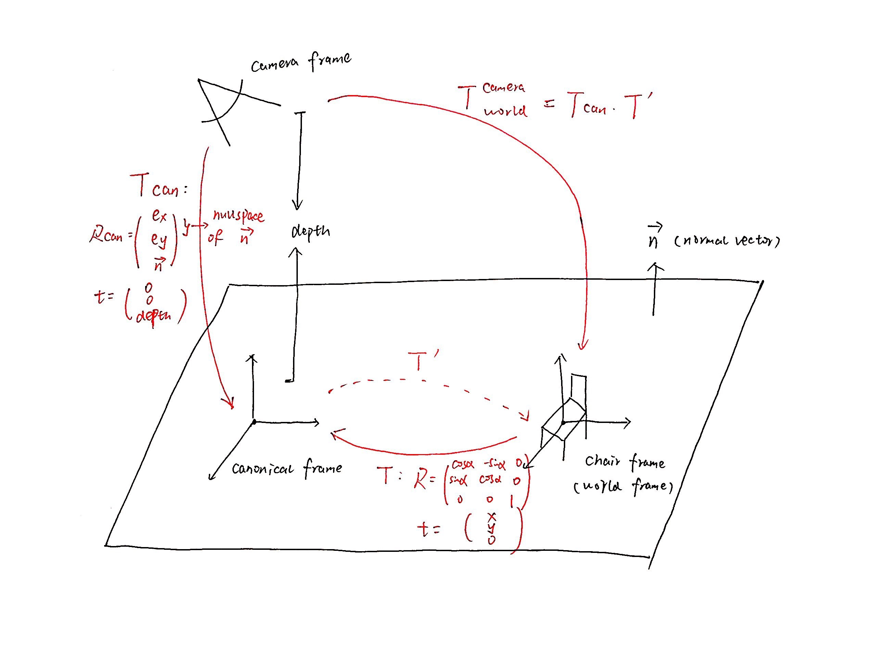

# PlaneTracker
This is a C++ progject of PlaneTracker for SLAM algorithm, it uses math modeling method to establish ground plane for localiztion, without time consuming texture extraction and matching, this method can efficiently contribute to the real-time SLAM. 

The mainly denpends on: 
 
- <a href="https://developer.microsoft.com/en-us/windows/kinect" target="_blank" style="color:blue">Kinect II</a>   
- <a href="http://eigen.tuxfamily.org/index.php?title=Main_Page" target="_blank" style="color:blue">Eigen3</a>  
- <a href="https://drive.google.com/file/d/1AsbFjWnSb9wbsEJpaNeeAZErSJWrjFaI/view" target="_blank" style="color:blue">OpenGL</a>
- Polyview(not open source yet)

The main pipeline includes:  

- Establish math model of Ground Plane  
- Detect and Project Chair on the ground to get center and direction of chair  
- Get R and t for each pose of the camera

The main rotaion model in this project is drawn as below. By setting up a canonical frame between camera frame and world frame, whose Z axis shares the same direction with normal vector of the groundplane, the camera frame's pose can be deduced from Depth image.

The project marks established math model of groundplane and object(chair), and calculate its position as shown below:

